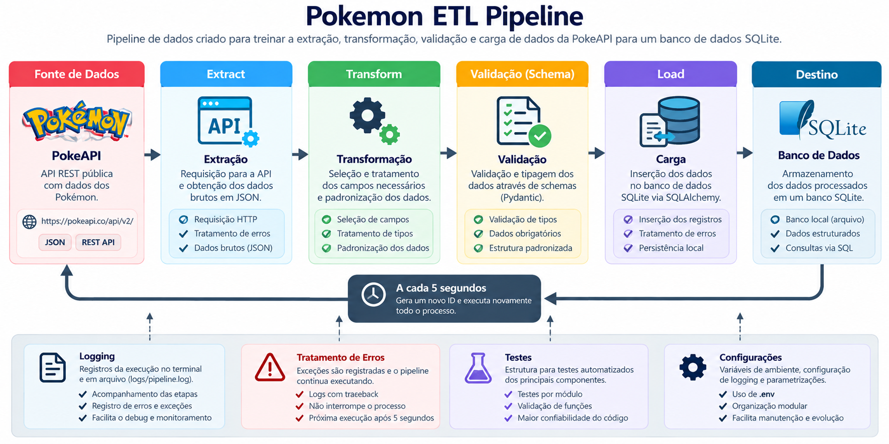

# Pokemon ETL Pipeline

## Sobre o projeto

Este projeto consiste na implementação de um pipeline ETL utilizando a PokeAPI como fonte de dados e SQLite como destino.

O projeto foi desenvolvido como um exercício prático para treinar a construção de pipelines de dados seguindo uma estrutura organizada e próxima dos padrões utilizados em projetos profissionais de Engenharia de Dados.

O principal objetivo não é a aplicação em si, mas praticar conceitos fundamentais envolvidos no desenvolvimento de um pipeline:

- Extração de dados através de uma API REST;
- Transformação e padronização dos dados;
- Validação dos dados através de schemas;
- Carga dos dados em banco de dados;
- Separação de responsabilidades entre as etapas do pipeline;
- Configuração de logging;
- Tratamento de exceções;
- Organização modular do código;
- Utilização de boas práticas de programação;
- Estruturação de um projeto preparado para evolução.

---

## Objetivo

O objetivo deste projeto é servir como uma implementação de referência para o padrão de desenvolvimento que será utilizado nos próximos projetos de estudo de Engenharia de Dados.

A partir deste projeto, a intenção é estabelecer uma estrutura base para trabalhar com diferentes tipos de fontes e destinos, mantendo separadas as responsabilidades de:

```text
Extract → Transform → Validate → Load

A API foi escolhida como source para praticar um cenário comum em Engenharia de Dados, no qual os dados precisam ser consumidos através de uma interface externa antes de serem processados e armazenados.

× Arquitetura:



O pipeline segue o fluxo:

                PokeAPI
                   |
                   v
              [ Extract ]
                   |
                   v
             Raw JSON data
                   |
                   v
             [ Transform ]
                   |
                   v
          Transformed data
                   |
                   v
              [ Schema ]
                   |
                   v
           Validated data
                   |
                   v
               [ Load ]
                   |
                   v
                 SQLite

Cada etapa possui uma responsabilidade específica.

× Extract:

Responsável pela comunicação com a API e obtenção dos dados brutos.

× Transform:

Responsável por extrair os campos necessários e transformar os dados recebidos para o formato esperado pelo pipeline.

× Schema:

Responsável pela validação e padronização da estrutura dos dados antes da persistência.

× Load:

Responsável por inserir os dados processados no banco de dados através do SQLAlchemy.

- Estrutura do projeto:

Pokemon-ETL-Pipeline/
│
├── src/
│   ├── config/
│   │   ├── database.py
│   │   ├── logging.py
│   │   └── settings.py
│   │
│   ├── extract/
│   │   └── pokemon_api.py
│   │
│   ├── transform/
│   │   └── pokemon.py
│   │
│   ├── schemas/
│   │   └── pokemon.py
│   │
│   ├── models/
│   │   └── pokemon.py
│   │
│   ├── load/
│   │   └── pokemon_db.py
│   │
│   ├── utils/
│   │   └── id_generator.py
│   │
│   └── main.py
│
├── logs/
│   └── pipeline.log
│
├── tests/
│
├── .env
├── .gitignore
├── pyproject.toml
├── uv.lock
└── README.md

- Organização das responsabilidades:
Diretório	          Responsabilidade
config/	            Configurações da aplicação, banco e logging
extract/	          Extração dos dados da API
transform/	        Transformação dos dados
schemas/	          Validação e definição dos contratos de dados
models/	            Modelos utilizados pelo SQLAlchemy
load/	              Persistência dos dados no banco
utils/	            Funções auxiliares
tests/	            Estrutura destinada aos testes automatizados
logs/	              Arquivos de log da execução

- Tecnologias utilizadas:

× Python
× Requests
× Pydantic
× SQLAlchemy
× SQLite
× python-dotenv
× uv
× Logging
× Logging

O pipeline possui um sistema de logging para acompanhar a execução tanto pelo terminal quanto através de um arquivo persistente.

Os logs registram informações relacionadas às principais etapas do pipeline, incluindo:

Início da execução;
Geração do identificador;
Início e conclusão da extração;
Transformação dos dados;
Validação do schema;
Carga no banco;
Erros e exceções;
Continuidade das execuções.

Os registros são armazenados em:

logs/pipeline.log

Além do registro em arquivo, os logs também são enviados para o terminal através de um StreamHandler.

O tratamento de exceções utiliza logging para preservar o contexto do erro e seu traceback, facilitando a identificação de problemas durante a execução.

Tratamento de erros

As principais operações do pipeline possuem tratamento de exceções.

Erros ocorridos durante uma execução são registrados através de logs e não interrompem necessariamente o processo contínuo do pipeline.

- Exemplo:

Extract
   |
   X
Erro
   |
   v
logging.exception()
   |
   v
Aguarda 5 segundos
   |
   v
Nova execução

Essa abordagem foi utilizada para praticar um comportamento mais próximo de processos de dados que precisam continuar executando mesmo quando uma determinada execução apresenta falha.

- Execução:

× Instale as dependências utilizando o uv:

uv sync

× Configure as variáveis de ambiente necessárias no arquivo .env.

× Execute o pipeline:

uv run python src/main.py

O pipeline executa o processo continuamente, gerando um novo identificador e realizando uma nova execução a cada 5 segundos.

× Para interromper a execução:

Ctrl + C


- Conceitos praticados:

Este projeto foi desenvolvido principalmente como exercício de aprendizado e prática dos seguintes conceitos.

 Engenharia de Dados
 Pipeline ETL;
 API como fonte de dados;
 Extração de dados;
 Transformação de dados;
 Validação;
 Persistência em banco de dados;
 Separação entre source, processamento e destination.
 Desenvolvimento
 Modularização;
 Separação de responsabilidades;
 Tratamento de exceções;
 Logging;
 Configuração através de variáveis de ambiente;
 Type hints;
 Organização de código;
 ORM;
 Validação de dados;
 Estruturação de projeto Python;
 Boas práticas de desenvolvimento.

A estrutura foi construída deliberadamente de forma modular para evitar que toda a lógica do pipeline fique concentrada em um único arquivo.

O main.py atua principalmente como orquestrador das etapas:

ID Generator
     |
     v
Extract
     |
     v
Transform
     |
     v
Schema Validation
     |
     v
Load

Essa separação permite que cada componente possa evoluir independentemente e facilita a manutenção e os testes.

- Testes:

O projeto possui uma estrutura destinada à implementação de testes automatizados.

A intenção é utilizar os testes para validar individualmente componentes do pipeline, evitando depender exclusivamente da execução completa do ETL para identificar problemas.

Entre os componentes que podem ser testados estão:

Geração de IDs;
Extração;
Transformação;
Validação dos schemas;
Carga dos dados.
Próximos passos

Este projeto representa uma implementação inicial de um pipeline ETL baseado em API.

A estrutura será utilizada como referência para os próximos projetos do Laboratório de Aprendizado de Engenharia de Dados, nos quais serão explorados diferentes tipos de sources, formatos de dados, destinos e ferramentas de processamento.

Entre os próximos cenários estão:

Extração a partir de bancos de dados;
Processamento de arquivos Parquet;
Diferentes estratégias de ingestão;
Pipelines incrementais;
Testes automatizados;
Orquestração com Airflow;
Transformações com dbt;
Docker;
Data Lake;
Processamento distribuído;
Monitoramento e observabilidade.
Conclusão

O projeto foi desenvolvido como uma etapa prática de aprendizado para consolidar uma estrutura base de desenvolvimento de pipelines de dados.

Mais do que o domínio de uma API específica, o objetivo foi praticar a construção de um ETL organizado, modular, observável e preparado para evolução.

A arquitetura adotada servirá como base para projetos posteriores com diferentes fontes, ferramentas e estratégias de processamento.
